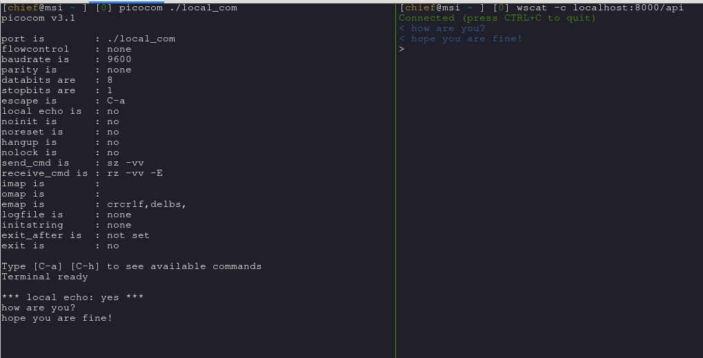

Provides access to a com-port device via REST and WebSockets.

To run as a service with pm2 use a helper script:

```bash
pm2 start pm2_wrapper.sh
pm2 logs pm2_wrapper.sh
pm2 save
```

To quickly test this on Linux:

- create a virtual com-port attached over USB, *socat* will run as a background job:

```bash
nohup sudo socat -d -d pty,raw,echo=0,link=/dev/ttyUSB100 pty,raw,echo=0,link=./local_com &
awk '/PTY is/ {a_prev=a; a=$NF} END{cmd="for i in " a_prev " " a "; do sudo chmod +777 $i; done"; system(cmd)}' nohup.out
```

- connect to it. Use *C-a C-c* to turn local echo on, *C-a C-q* to exit:

```bash
picocom ./local_com
```

- prepare *virtualenv* and activate it:

```bash
python3.8 -m virtualenv venv
. venv/bin/activate
pip install -r requirements.txt
```

- run the server like this:

```bash
venv/bin/hypercorn serious_quartz:app --error-log - --access-log -
```

- connect with a WebSocket client:

```bash
wscat -c localhost:8000/api
```

- type and send something in *picocom*:

[](https://www.youtube.com/watch?v=Q7wuADjRx10)

<div float="left">
    
</div>


- shut *socat* down:

```bash
a=$(jobs | awk -F'[][]' '/local_com/ {system("echo fg %"$2)}')
$a
```
